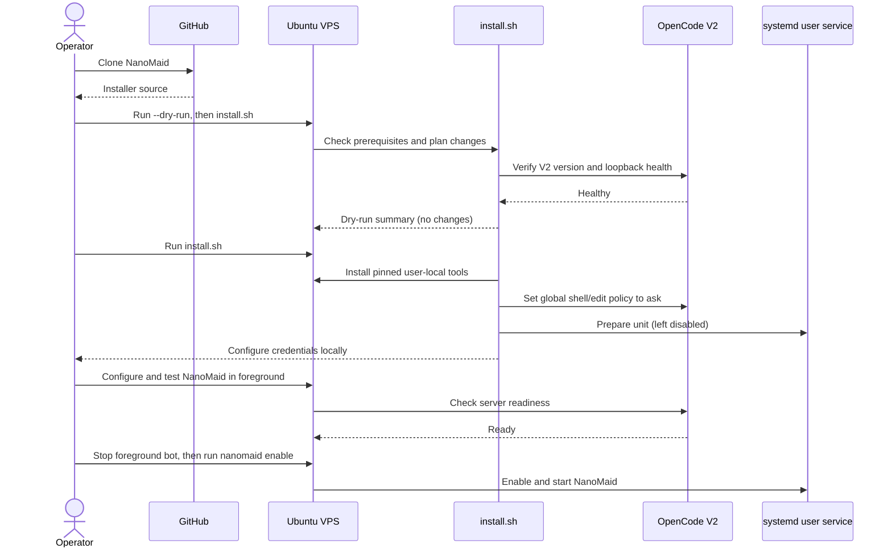
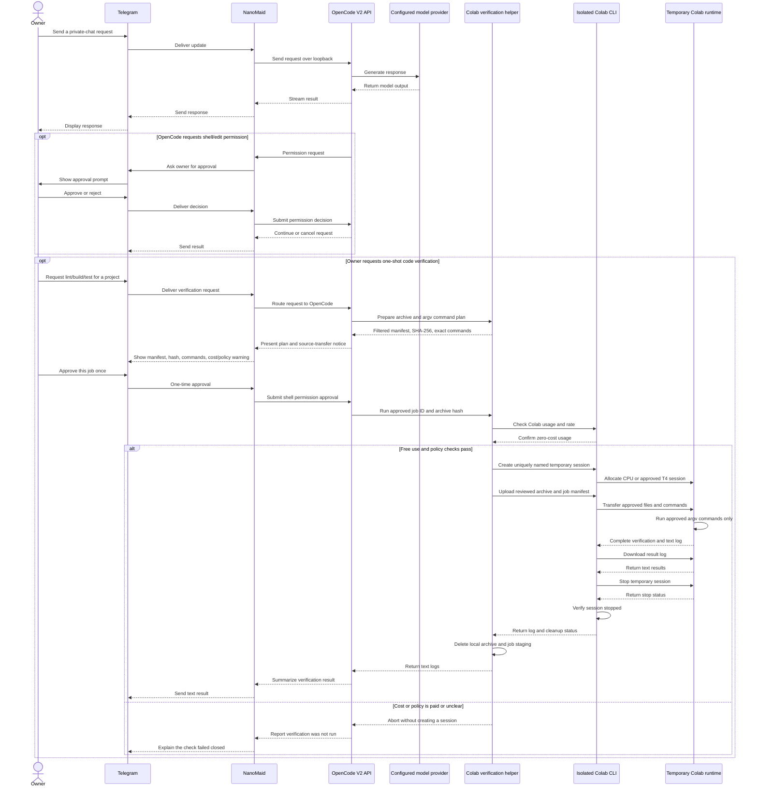

# NanoMaid

**A nano personal assistant living on a small VPS.** NanoMaid wraps the existing OpenCode V2 service in a private Telegram client and provides an approved, one-shot Colab code-verification path.

## Quick install

### Before you start

- Ubuntu 26.04 LTS, x86-64; run the installer as your normal user, not as root.
- OpenCode V2 must already be installed, configured with a model/provider, healthy, and bound to loopback.
- User-level systemd lingering must already be enabled. The installer will not use `sudo` or change lingering.
- At least 150 MiB of available RAM is required by the preflight check.
- Create a Telegram bot with BotFather. After configuration, disable group joining for the bot.

Clone NanoMaid and review the dry-run before installing:

```bash
git clone https://github.com/arinadi/nanomaid.git
cd nanomaid
./install.sh --dry-run
./install.sh
```

The installer uses pinned, user-local tools. It does not enter credentials or enable/start the service. It also changes the global OpenCode `shell` and `edit` permission policies to `ask`; this affects every client sharing that OpenCode configuration, including TUI and desktop.

In a real local terminal, configure the Telegram token, owner ID, and OpenCode password interactively. Never paste credentials or OAuth codes into Telegram or commit them:

```bash
~/.local/bin/nanomaid configure
```

Test the bot in the foreground. Wait for the bot and OpenCode to report ready, then press **Ctrl+C** before enabling the systemd service; do not run two Telegram pollers at once.

```bash
~/.local/bin/nanomaid start
```

After the foreground test succeeds and RAM headroom is safe, enable the service:

```bash
~/.local/bin/nanomaid enable
```

Check the service with `~/.local/bin/nanomaid status` and view logs with `journalctl --user -u nanomaid.service`.

## Supported target

- Ubuntu 26.04 LTS, x86-64
- OpenCode V2 already installed, authenticated, and configured with a model/provider
- A single Telegram owner; private chat only
- User-level `systemd` with lingering already enabled
- No Docker, public listener, or firewall changes

The installer pins Node.js, uv, the Telegram wrapper, and Google Colab CLI. It uses user-local tools only and does not require apt/sudo. It is safe to re-run and has dry-run/check modes. NPM lifecycle scripts are disabled; the pinned wrapper release includes a Linux SQLite prebuild, which is smoke-tested during validation. It does not install or configure OpenCode providers, store secrets in this repository, or publish a remote Git repository.

## Sequence diagrams

### Deployment



### Telegram request and OpenCode response



Colab is for user-approved, one-shot code-verification checks only. CPU is the default; an optional T4 can be requested for a finite check when Colab allocates it and reports T4 hardware. NanoMaid requires zero paid-unit balance; a positive usage-rate meter by itself does not block a free allocation. No paid compute, TPU, high-memory runtime, Drive mount, persistent session, bot, web service, audio/image/video, or unrelated datasets. Only reviewed source files and exact argv commands are sent to Google. Free GPU availability is dynamic and not guaranteed; if T4 is not allocated, the job stops.

## Colab code verification

Colab CLI is installed in an isolated Python environment. All CLI calls should go through `~/.local/bin/nanomaid colab ...`, which uses NanoMaid's isolated OAuth `HOME`; a raw `colab` call may use a different profile. Run `~/.local/bin/nanomaid colab-auth` in a real terminal to authenticate. Never paste the OAuth code or credentials into Telegram. Check account state with `~/.local/bin/nanomaid colab sessions` and `~/.local/bin/nanomaid colab usage`.

For code verification, create a command JSON using argv arrays (not shell strings), then run `~/.local/bin/nanomaid verify plan PROJECT_DIR COMMANDS.json`. CPU is selected when `accelerator` is omitted; set `"accelerator": "T4"` only for a finite check. Review the complete source manifest, archive SHA-256, job-manifest SHA-256, commands, and accelerator before approving each upload/run. The helper requires zero paid-unit balance, requests T4 only when approved in the job, verifies T4 before upload, and treats a positive hourly rate as informational. Execute the exact plan with `~/.local/bin/nanomaid verify run JOB_ID ARCHIVE_SHA256 JOB_SHA256 --free-confirmed`. It excludes environment files, keys, secrets, common media, and datasets; returns text logs; stops the temporary session; and deletes local staging.

Example T4-only test manifest:

```json
{
  "commands": [["python3", "-m", "unittest", "discover", "-s", "tests", "-v"]],
  "accelerator": "T4"
}
```

Colab is not Docker or a persistent bot host. Free-tier capacity and policy are not guaranteed; a T4 may be unavailable even when usage is zero. NanoMaid verification never hosts bots or web services. Finance/transcription bots and their input media remain separate and are not installed by this project.

## Security and rollback

- The app token and OpenCode V2 password live only in the local bot config (`~/.config/opencode-telegram-bot/.env`) with mode `0600`; never commit that file.
- Disable group joining for the bot in BotFather; the installer cannot change BotFather settings. The installer sets `umask 077` for secret setup.
- OpenCode global shell and file-edit actions require approval; this also affects TUI/desktop clients sharing the service.
- The installer merges only a marked NanoMaid block into global `AGENTS.md`, preserving the existing rules and creating a mode-0600 backup before edits. `./check.sh` verifies the block; the uninstaller preserves it with the rest of OpenCode config.
- Local JSON shell commands, scheduled tasks, and the bot's OpenCode start/stop controls remain unused.
- `./check.sh` checks prerequisites and service health. `./uninstall.sh` stops/removes NanoMaid's service and runtime but preserves credentials, OpenCode sessions/config, and user lingering.
