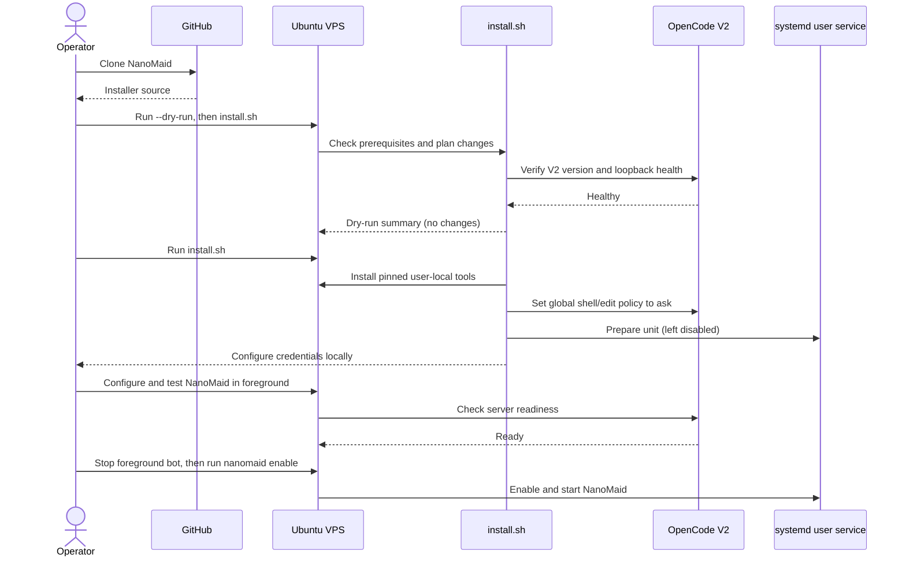
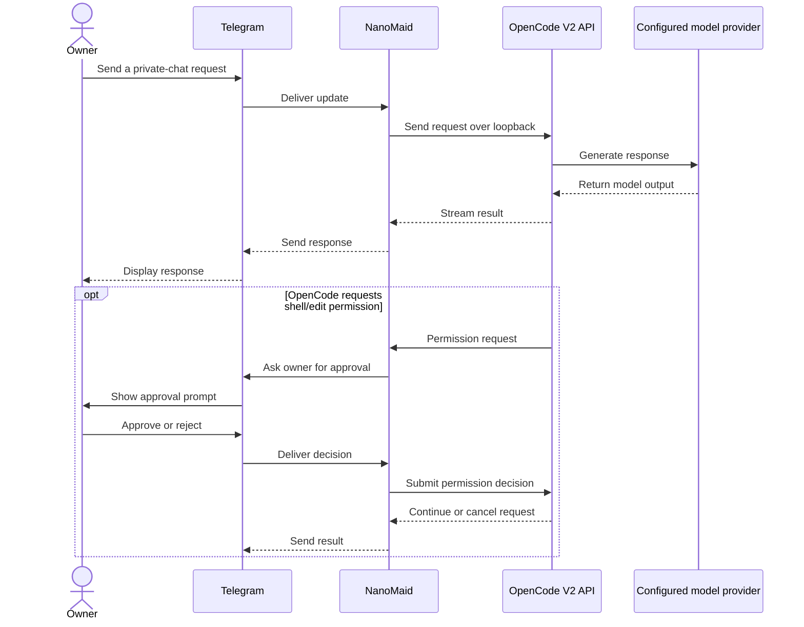

# NanoMaid

**A nano personal assistant living on a small VPS.** NanoMaid wraps the existing OpenCode V2 service in a private Telegram client and provides an approved, one-shot Colab code-verification path.

## Quick install

### Before you start

- Ubuntu 26.04 LTS, x86-64; run the installer as your normal user, not as root.
- OpenCode V2 must already be installed, configured with a model/provider, healthy, and bound to loopback.
- User-level systemd lingering must already be enabled. The installer will not use `sudo` or change lingering.
- At least 150 MiB of available RAM is required by the preflight check.
- Create a Telegram bot with BotFather. After configuration, disable group joining for the bot.

Clone NanoMaid and review the dry-run before installing:

```bash
git clone https://github.com/arinadi/nanomaid.git
cd nanomaid
./install.sh --dry-run
./install.sh
```

The installer uses pinned, user-local tools. It does not enter credentials or enable/start the service. It also changes the global OpenCode `shell` and `edit` permission policies to `ask`; this affects every client sharing that OpenCode configuration, including TUI and desktop.

In a real local terminal, configure the Telegram token, owner ID, and OpenCode password interactively. Never paste credentials or OAuth codes into Telegram or commit them:

```bash
~/.local/bin/nanomaid configure
```

Test the bot in the foreground. Wait for the bot and OpenCode to report ready, then press **Ctrl+C** before enabling the systemd service; do not run two Telegram pollers at once.

```bash
~/.local/bin/nanomaid start
```

After the foreground test succeeds and RAM headroom is safe, enable the service:

```bash
~/.local/bin/nanomaid enable
```

Check the service with `~/.local/bin/nanomaid status` and view logs with `journalctl --user -u nanomaid.service`.

## Supported target

- Ubuntu 26.04 LTS, x86-64
- OpenCode V2 already installed, authenticated, and configured with a model/provider
- A single Telegram owner; private chat only
- User-level `systemd` with lingering already enabled
- No Docker, public listener, or firewall changes

The installer pins Node.js, uv, the Telegram wrapper, and Google Colab CLI. It uses user-local tools only and does not require apt/sudo. It is safe to re-run and has dry-run/check modes. NPM lifecycle scripts are disabled; the pinned wrapper release includes a Linux SQLite prebuild, which is smoke-tested during validation. It does not install or configure OpenCode providers, store secrets in this repository, or publish a remote Git repository.

## Sequence diagrams

### Deployment



### Telegram request and OpenCode response



## Colab code verification

Colab CLI is installed in an isolated Python environment. Run `~/.local/bin/nanomaid colab-auth` in a real terminal to authenticate your account into NanoMaid's isolated Colab home. Never paste the OAuth code or credentials into Telegram.

For code verification, review the proposed project file manifest and exact lint/build/test commands before approving each upload/run. Only approved source files are sent to Google. The helper excludes environment files, keys, secrets, media, and datasets; the first version is CPU-only and returns text logs. Stop the temporary Colab session after every job.

Colab is not Docker or a persistent bot host. Free-tier capacity and policy are not guaranteed. Finance/transcription bots and their input media remain separate and are not installed by this project.

## Security and rollback

- The app token and OpenCode V2 password live only in the local bot config (`~/.config/opencode-telegram-bot/.env`) with mode `0600`; never commit that file.
- Disable group joining for the bot in BotFather; the installer cannot change BotFather settings. The installer sets `umask 077` for secret setup.
- OpenCode global shell and file-edit actions require approval; this also affects TUI/desktop clients sharing the service.
- Local JSON shell commands, scheduled tasks, and the bot's OpenCode start/stop controls remain unused.
- `./check.sh` checks prerequisites and service health. `./uninstall.sh` stops/removes NanoMaid's service and runtime but preserves credentials, OpenCode sessions/config, and user lingering.
